# مخططات المشروع — المستشار القانوني السوري
# Syrian Legal Advisor — Project Diagrams

---

## 1. Use Case Diagram — مخطط حالات الاستخدام

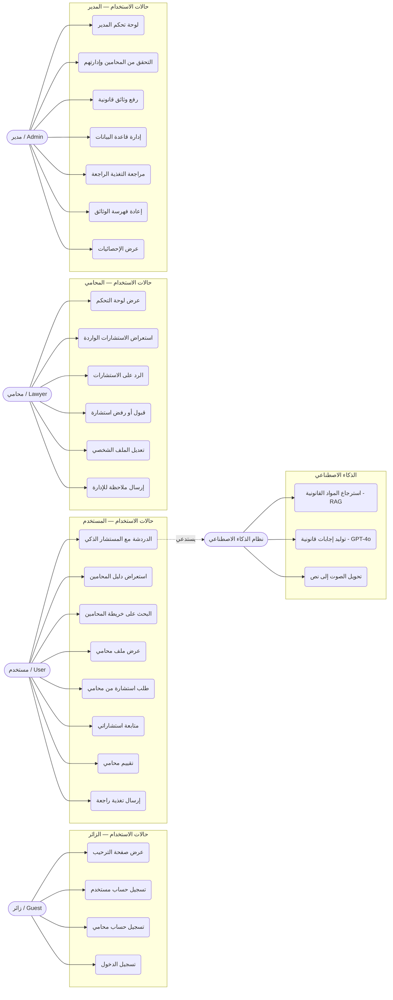

---

## 2. Class Diagram — مخطط الفئات

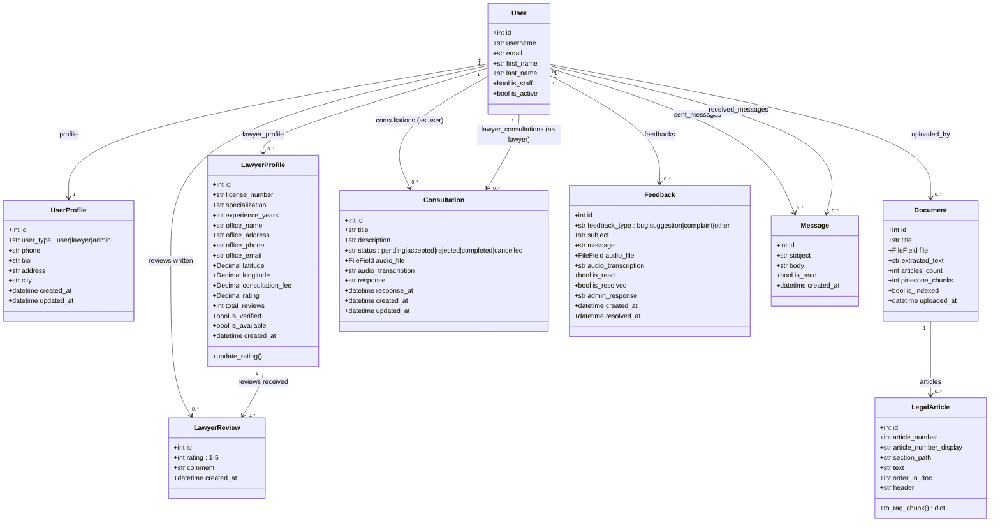

---

## 3. ERD — مخطط علاقات الكيانات

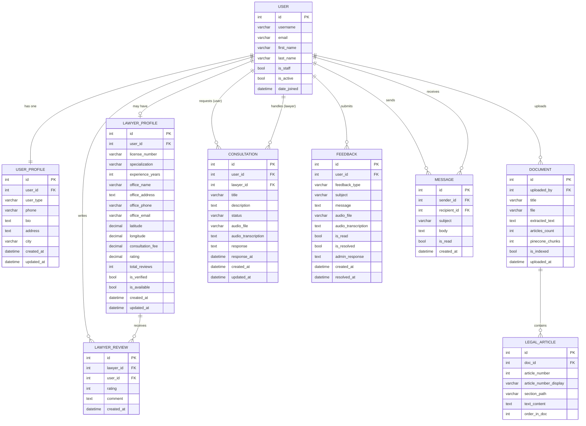

---

## 4. Sequence Diagrams — مخططات التسلسل

### 4.1 تسجيل الدخول وإعادة التوجيه الذكية

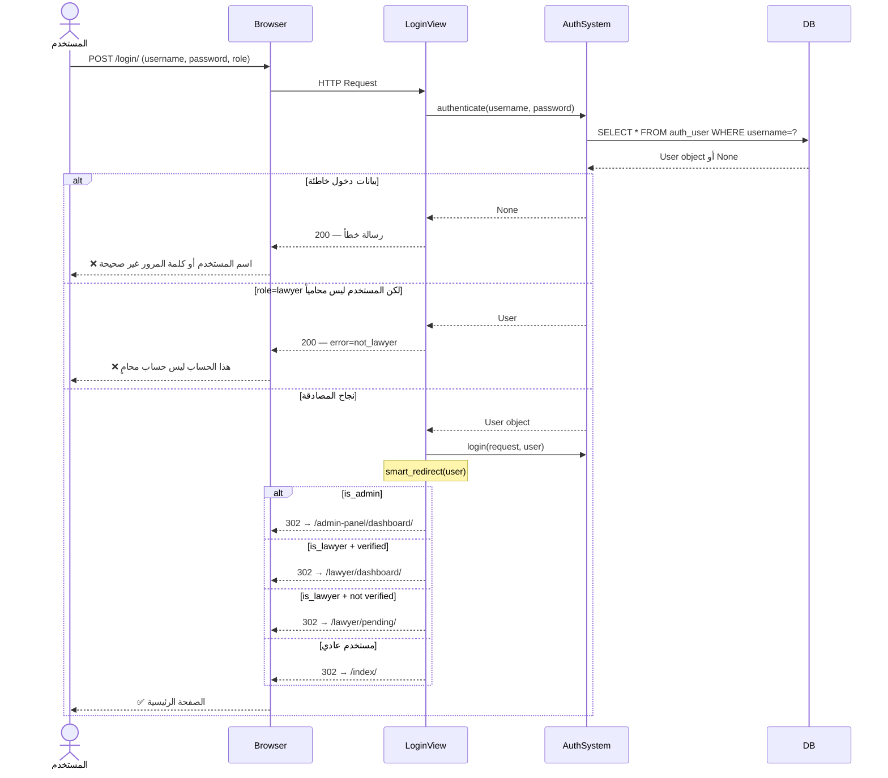

---

### 4.2 الدردشة مع المستشار الذكي — RAG Hybrid

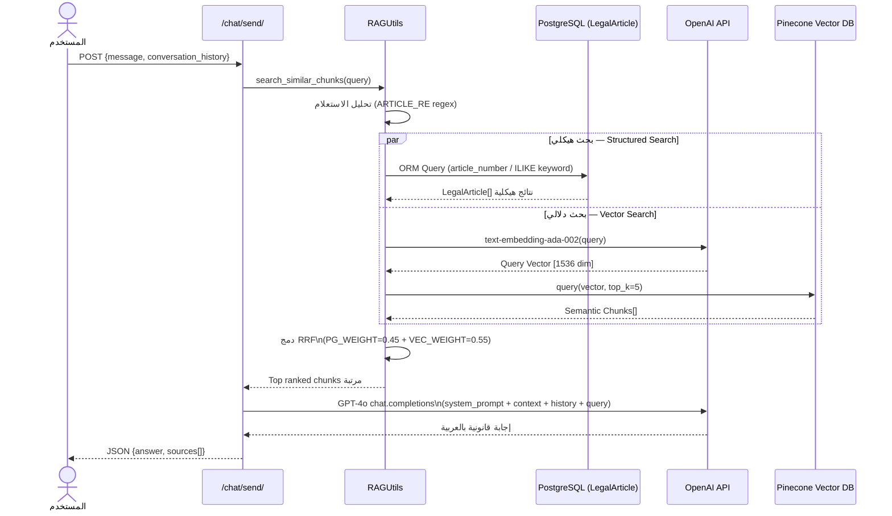

---

### 4.3 تسجيل محامي جديد والتحقق منه

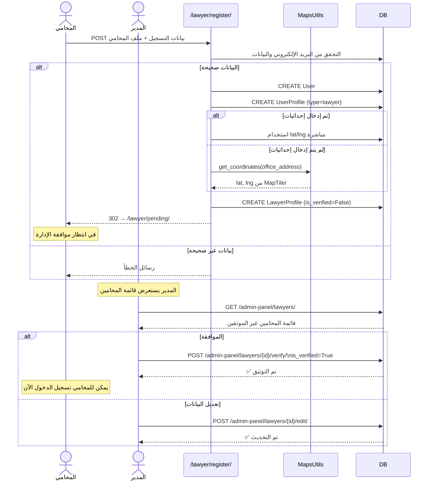

---

### 4.4 طلب استشارة ومعالجتها

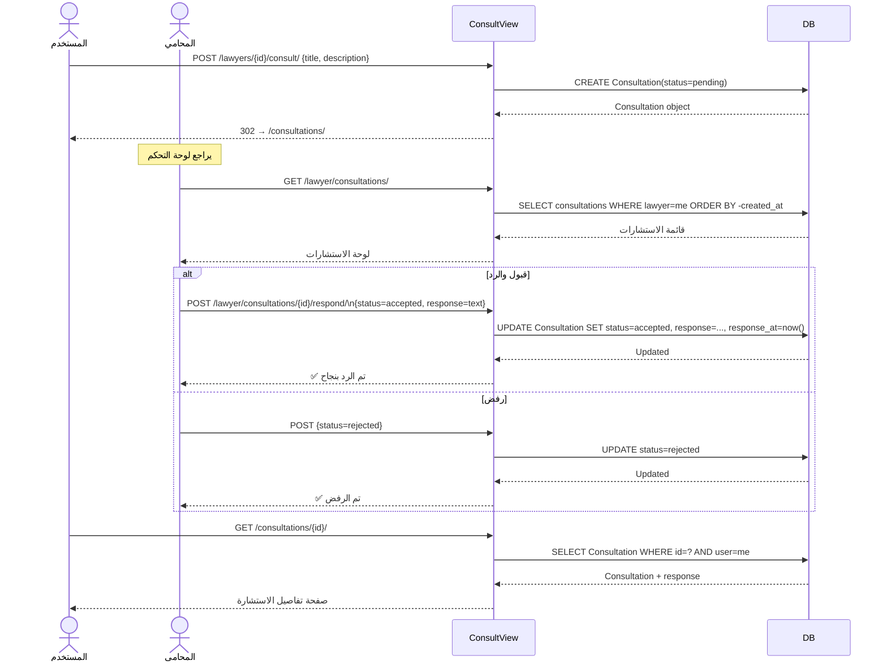

---

### 4.5 رفع وفهرسة وثيقة قانونية

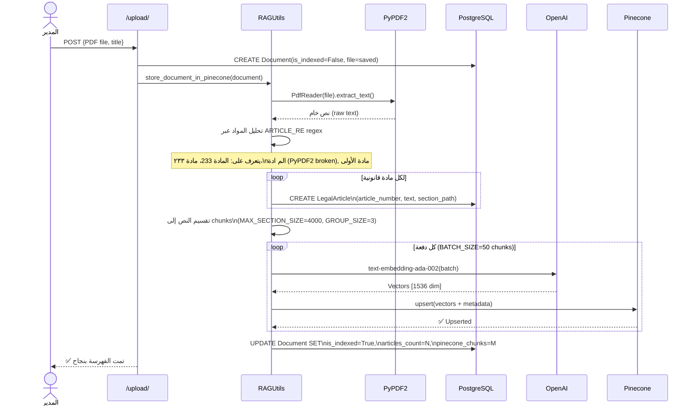

---

## 5. Flowcharts — مخططات التدفق

### 5.1 تدفق تسجيل المستخدم العادي

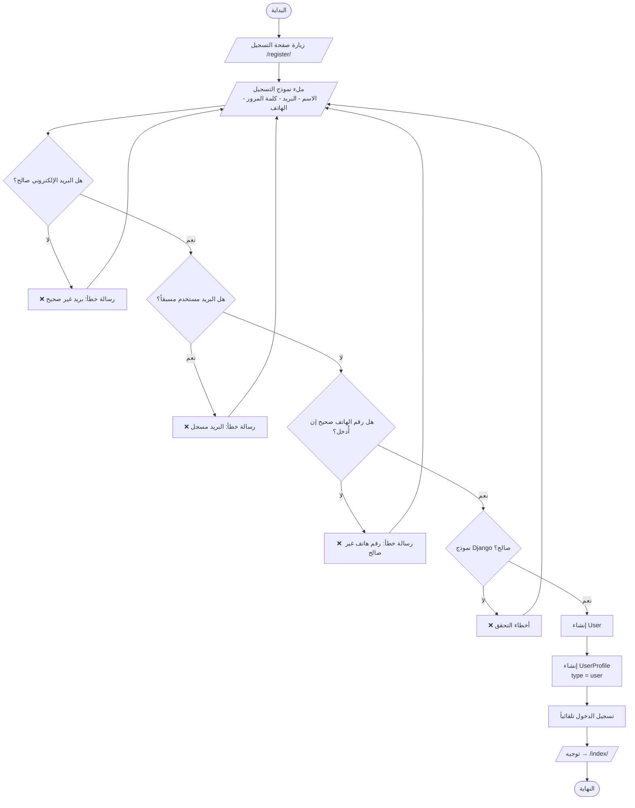

---

### 5.2 تسجيل محامي والتحقق الإداري

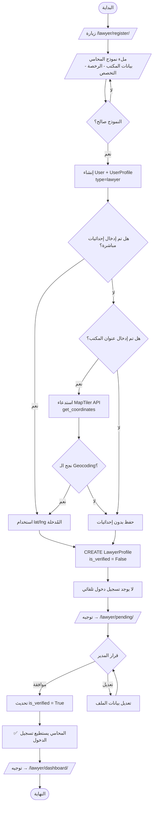

---

### 5.3 تدفق معالجة الاستعلام بـ RAG الهجين

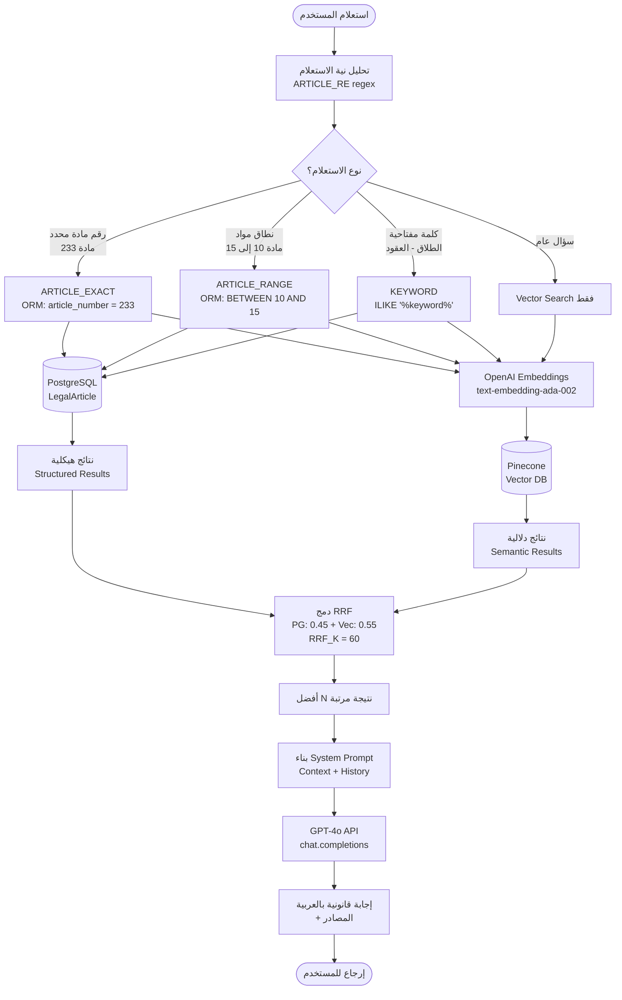

---

### 5.4 دورة حياة الاستشارة

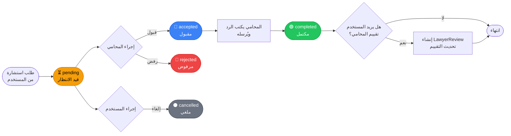

---

## 6. System Architecture — معمارية النظام

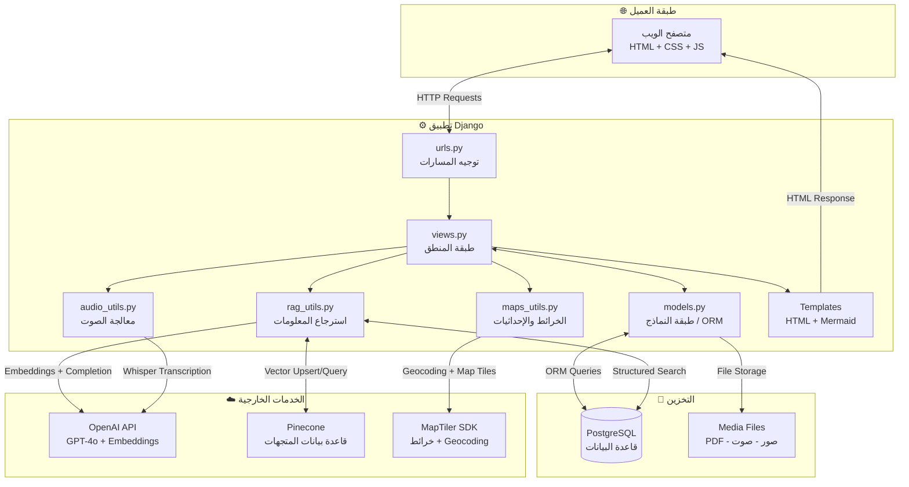

---

## 7. Admin Workflow — سير عمل لوحة الإدارة

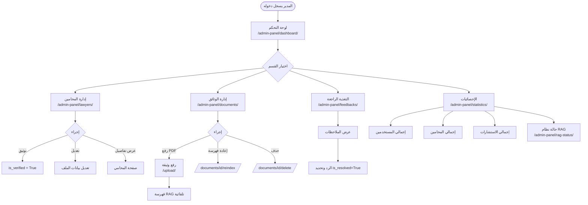

---

## 8. Lawyer Dashboard Workflow — سير عمل لوحة المحامي

```mermaid
flowchart TD
    A([المحامي يسجل دخوله]) --> B{is_verified?}
    B -- لا --> C[/lawyer/pending/\nفي انتظار موافقة الإدارة]
    B -- نعم --> D[/lawyer/dashboard/\nلوحة التحكم]

    D --> E{اختيار القسم}

    E --> F[الاستشارات الواردة\n/lawyer/consultations/]
    F --> G[قائمة الاستشارات\nمرتبة حسب التاريخ]
    G --> H{إجراء على استشارة}
    H -- قبول والرد --> I[كتابة الرد النصي\nأو الصوتي]
    I --> J[status = accepted\nresponse_at = now]
    H -- رفض --> K[status = rejected]

    E --> L[تعديل الملف الشخصي\n/lawyer/profile/edit/]
    L --> M[تحديث البيانات\nالتخصص - العنوان - الرسوم]
    M --> N[حفظ التغييرات]

    E --> O[إرسال ملاحظة للإدارة\n/lawyer/feedback/]
    O --> P[CREATE Feedback\ntype, subject, message]
```

---

*تم إنشاء هذا الملف تلقائياً لمشروع المستشار القانوني السوري*
*Generated for: Syrian Legal Advisor — Django + RAG + MapTiler*
